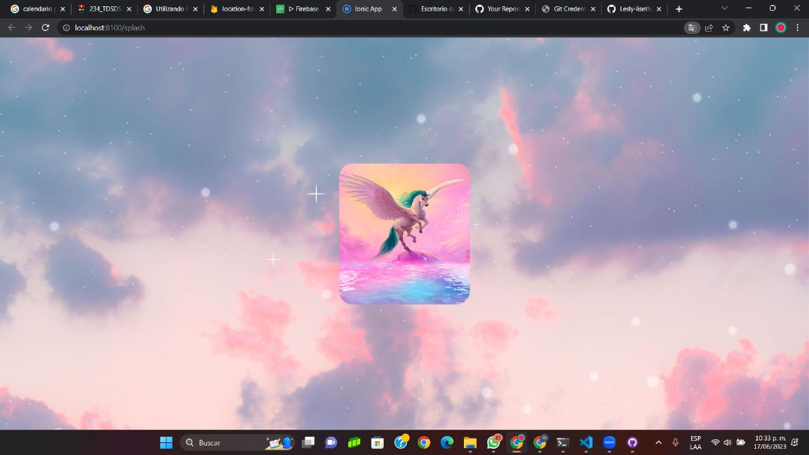

# Ubicacion de las Fotos

El prosente proyecto es creado en ionic con el proposito de al iniciar la aplicacion nos aparezca un splash screem, luego que podamos tomar una foto y una vez guardada la foto nos de la ubicacion de dicha foto tomada

##Integrante
Lesly Herrera

## Splash Screem
la presente pantalla es de Bienvenida la cual se muestra al iniciar la aplicacion

##Pantalla de inicio
en la siguiente pantalla se muestra el icono de la camara el cual nos permitera tomar la foto

##Foto
aqui vamos a poder tomar la foto

##Mensaje de exito
Al momento de guardar la fotos nos mostrara un mensaje de exito o de error segun sea el caso, por ejemplo aqui me sale un mensaje de exito ya que si se guardo correctamente.

##Fotos tomadas
en la siguiente pagina nos va a mostrar las fotos que se an tomado con su latitud y longitud

##Firestore Database
aqui se va a guardar la informacion como logitud, latitud y url de imagenes

##Storage
finalmente aqui nos va almacenar las imagenes

